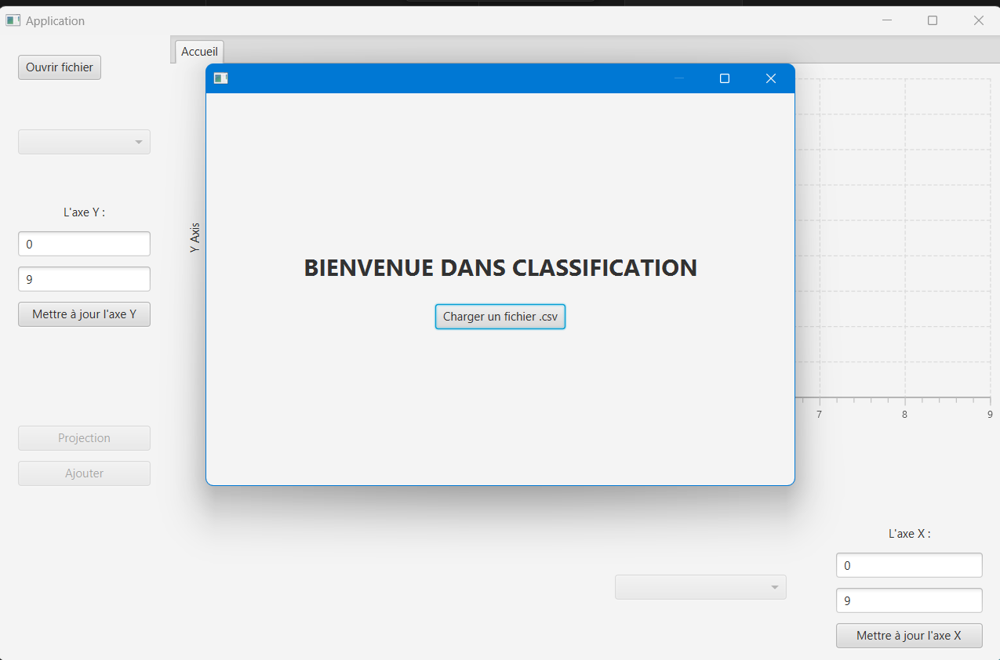
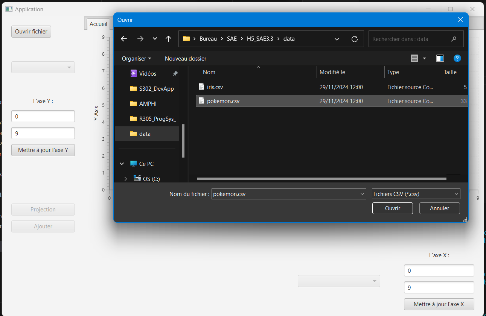
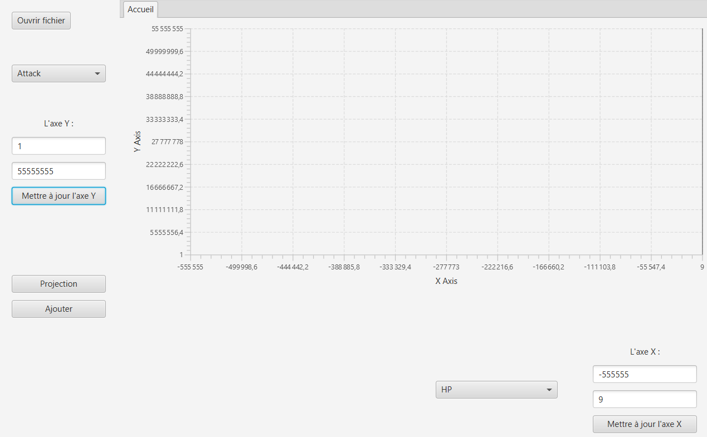
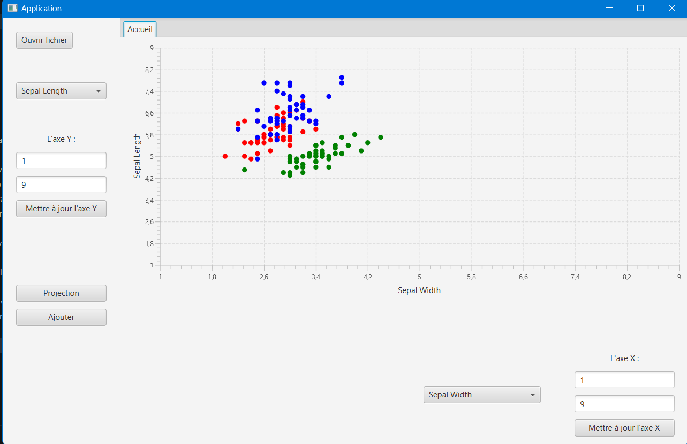
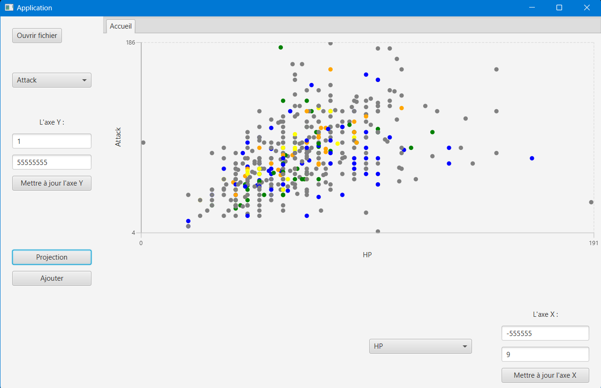
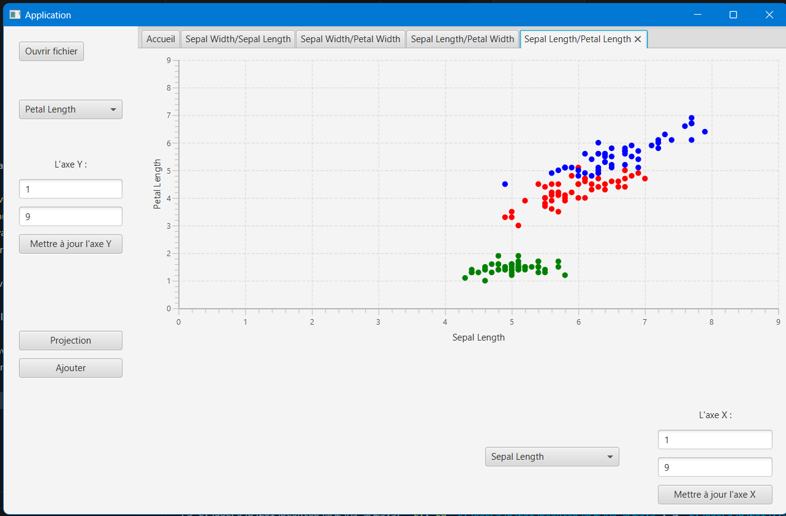
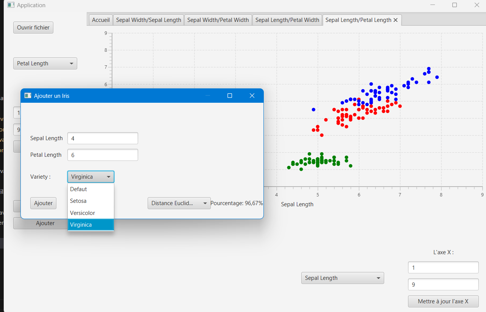
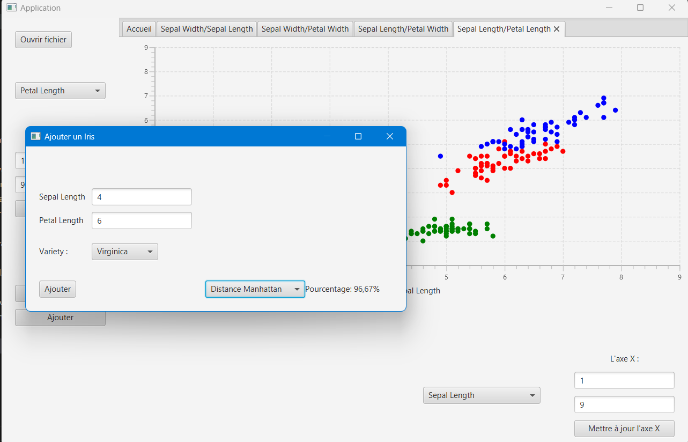
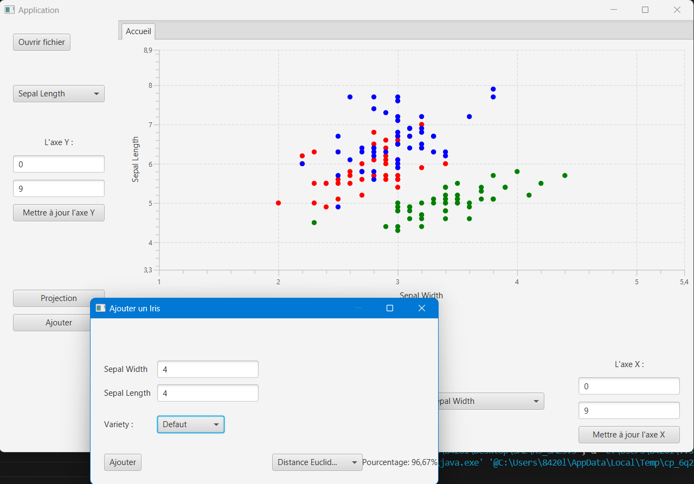
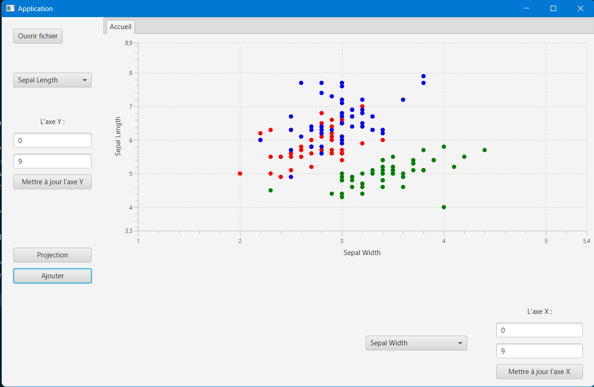

# PROJET DE CLASSIFICATION DE DONNÉES

**Réalisé par :**  
DE JESUS TEIXEIRA Lucas  
WILFART Axel  
LAMOUR Enzo  
RANDOUX Martin

*Projet réalisé pour la SAE3.02 - Développement d'une application*

---

## Description : 

Ce projet propose un outil permettant de charger et d'afficher visuellement un ensemble de données variées. Il offre également des fonctionnalités de classification, permettant de comparer et de catégoriser de nouvelles données en fonction des ensembles de données précédemment chargés. Grâce à cet outil, les utilisateurs peuvent analyser efficacement les informations qu'ils veulent.

---

## Comment utiliser l'application :

**Pour Exécuter sur Linux:**  
> Aller dans un terminal :  
`chmod u+x run.sh`  
`./run.sh`  
*Si maven est installé dans votre machine, la commande devrait s'éxécuter*

### Guide d'Utilisation de l'Application

#### Page d'accueil

- **Sur la page d'accueil**, vous devrez charger un fichier `.csv`, mais ne vous inquiétez pas, vous pourrez toujours changer de fichier une fois sur la page principale.

#### Modification des Axes
- **Sur la page principale**, vous pouvez ajuster les tailles des axes X et Y.

#### Projections
- **Projection des données** : Vous pouvez choisir de projeter des données d'Iris.

- **Projection des données** : Ou choisir de projeter des données de Pokémon.

#### Gestion des Projections
- **Changement de projection** : Vous pouvez soit "écraser" votre projection actuelle, soit créer un nouvel onglet pour avoir une projection totalement différente.

#### Ajout de Point
- **Ajout de point** : Vous pouvez ajouter un point manuellement.

- **Algorithme KNN** : Ou mettre en `Default`, lorsque cette option est sélectionnée, l'algorithme KNN (algorithme de classification) déterminera la valeur la plus appropriée pour votre point. Il peut gérer la distance de Manhattan.

- **Algorithme KNN** : Il peut également gérer la distance Euclidienne.

- **Robustesse** : La robustesse est indiquée en bas à droite de l'écran. Une fois ajouté, vous verrez votre point classifié.

Merci d'avoir lu ce guide ! ;)

---

## Attribution des tâches principales : 

**Jalon 1 :**  

Lucas :
- OpenCSV et tout le chargement de données + Test
- Documentation des fichiers
- Notice et lancement de l'application

Axel :
- Fonctionnalités de l'application
- Affichage de l'application

Enzo :   
- Fonctionnalités de l'application
- Affichage des points dans l'application

Martin :  
- Démarrage de l'application
- Affichage du graphique

**Jalon 2 :**  

Lucas :
- README.md, run.sh, Documentation
- Travail sur le K-NN
- Modification de l'IHM

Axel :
- Rendu de Dev Efficace
- Qualité/Efficacité du programme
- Travail sur le K-NN
- Modification de l'IHM

Enzo :  
- Préparation de la Soutenance
- Implémentation du K-NN
- Nouvelles fonctionnalités (et supplémentaires) de l'IHM
- Vérification IHM

Martin :  
- Préparation de la Soutenance
- Projet en Modèle MVC
- Travail sur le K-NN
- Modification de l'IHM
