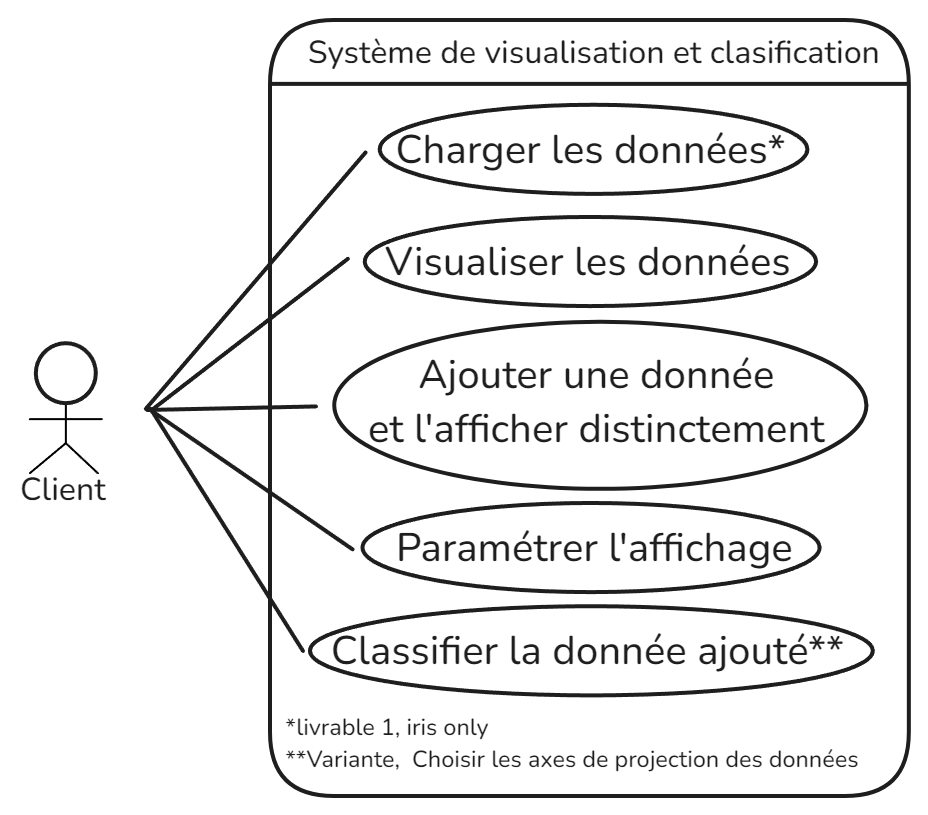
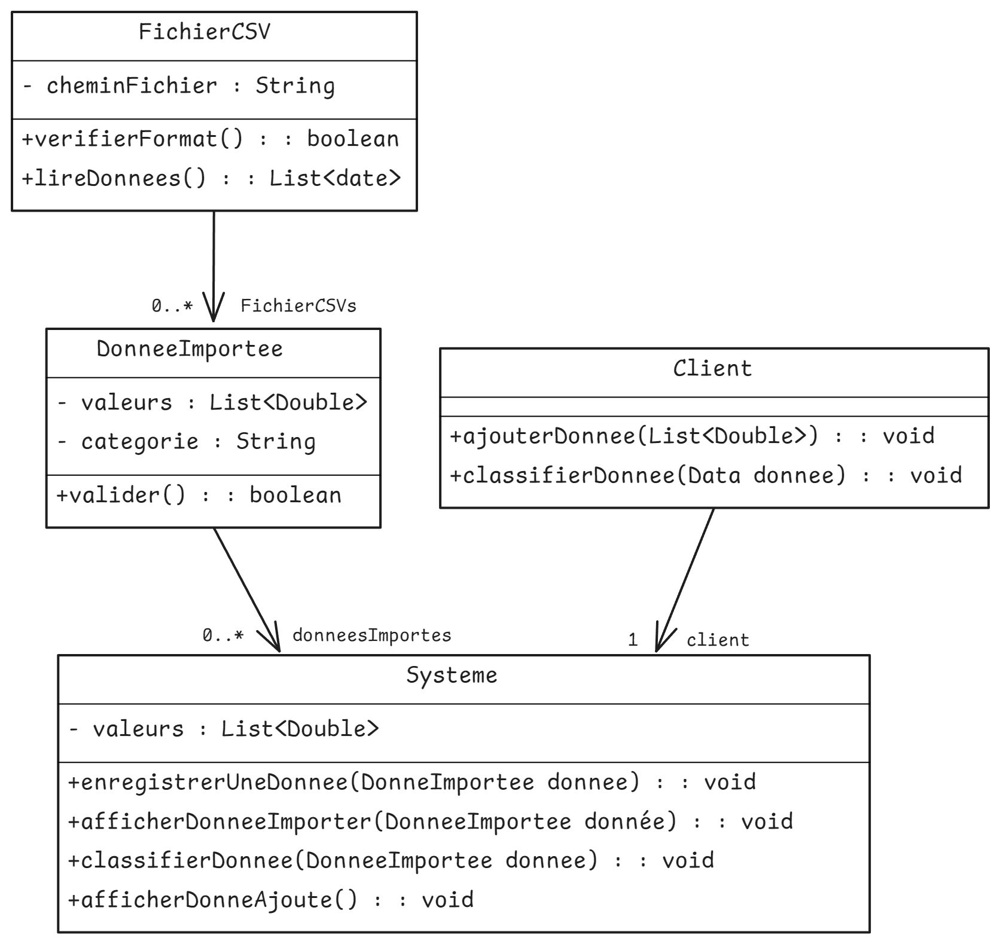

# Rendu Analyse

### Équipe H5
DE JESUS TEIXEIRA Lucas\
RANDOUX Martin\
WILFART Axel\
LAMOUR Enzo

### Organisation du travail

**DE JESUS TEIXEIRA Lucas :**

- Contribution aux prototypes
- Contribution aux fiches descriptives 1 et 2
- Contribution à la rédaction du dossier

**RANDOUX Martin :**

- Contribution aux prototypes
- Contribution aux fiches descriptives 2
- Contribution au diagramme des classes

**WILFART Axel :**

- Forte Contribution aux prototypes
- Contribution au diagramme de cas d'utilisation
- Contribution au diagramme des classes

**LAMOUR Enzo :**

- Contribution aux prototypes
- Contribution aux fiches descriptives 3
- Forte Contribution au diagramme des classes

## Diagramme de cas d'utilisation

## Fiches descriptives

Fiche Descriptive 1
---

- **Système**: Système de visualisation et classification
- **Cas d'utilisation**: Charger l'ensemble de données

- **Acteur principal**: Client
- **Déclencheur**: /
- **Autre acteurs**: /

- **Préconditions**: Le client doit fournir les données sous forme de fichiers CSV.
- **Garanties en cas de succès**: Les données sont enregistrées. Le modèle est construit à partir de ces données.
- **Garanties minimales**: Si le scénario ne finit pas, aucune donnée sera enregistré et le modèle restera vide.

- **Scénario nominal**: 
1. Le client sélectionne la fonctionnalité "Charger ses données"
2. Le système lui demande le nom de son fichier CSV
3. Le client donne le nom du fichier CSV correspondant aux données
4. Le système enregistre les données en les récupérant dans ce fichier CSV et affiche les données sous nuage de points.

- **Scénarios alternatifs**:
    + **A** : A l'étape 4, le fichier n'a pas été trouvé ou n'est pas au bon format.
    - 4(A) : Le système avertit le client avec un message d'erreur.
    - 5(A) : Retour à l'étape 1

Fiche Descriptive 2
---

- **Système**: Système de visualisation et classification
- **Cas d'utilisation**: Ajouter une donnée

- **Acteur principal**: Client
- **Déclencheur**: /
- **Autre acteurs**: /

- **Préconditions**: Le client doit avoir déjà fourni des données et avoir une donnée à ajouter.
- **Garanties en cas de succès**: La donnée est enregistré. L'affichage est rafraîchit avec cette nouvelle donnée.
- **Garanties minimales**: Si le scénario ne finit pas, cette donnée ne sera pas enregistré et l'affichage restera comme il était.

- **Scénario nominal**: 

1. L’utilisateur saisie les valeurs dans les champs correspondants et valide sa donnée
2. Le système enregistre cette nouvelle donnée et modifie l'affichage.

- **Scénarios alternatifs**:
+ **A** : A l’étape 2, les valeurs saisie par l’utilisateur sont incorrects
- 2(A) :  Le système averti l’utilisateur en émettant un message d'erreur et lui demande de corriger ses valeurs
- 3(A) : Retour à l’étape 1

Fiche Descriptive 3
---

- **Système**: Système de visualisation et classification
- **Cas d'utilisation**: Classifier la donnée non classifiée

- **Acteur principal**: Client
- **Déclencheur**: /
- **Autre acteurs**: /

- **Préconditions**: Avoir ajouté une donnée
- **Garanties en cas de succès**: Cette donnée a été classifié dans la catégorie la plus probable pour cette donnée.
- **Garanties minimales**: Aucune catégorie lui convient donc elle est supprimée.

- **Scénario nominal**: 

1. Le client clique sur la fonctionnalité "Classifier"
2. Le systéme classifie les nouvelles données, affiche les nouvelles données mise en avant avec leur catégorie

- **Scénarios alternatifs**:
- A l'étape 2, si les données ne sont pas valide
- 2(A) : Le systéme affiche un message d'erreur informant des données non valide
- reprend à l'étape 2

## Prototypes pour l'interface
---

[Fichier contenant les prototypes de l'interface](Prototype_basse_fidelite.pdf)

[Lien Figma au cas où](https://www.figma.com/design/UkQAUDAZHdLqFkSxj90ojb/SAE-H3?node-id=1-3371&t=kHTXrBXVV5nbXf4y-1)

## Diagramme de classes
---

